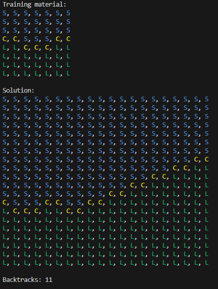
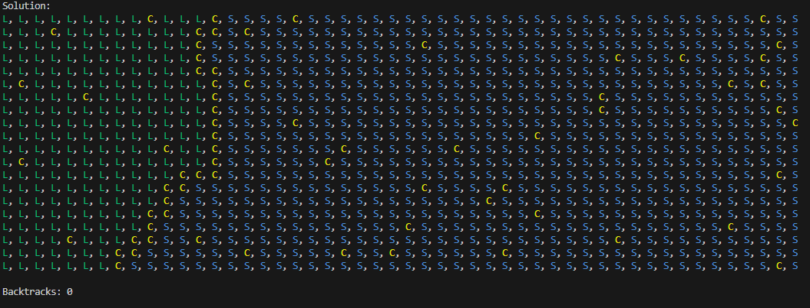

# Wave Function Collapse Solver

This project is my attempt at implementing the wave function collapse algorithm.
The WFC algorithm has two parts, the constraint generator, and the constraint
solver. The constraint solver was implemented first, 

#### Constraint solver

The constraint solver takes a description of some constraints and a layout
describing the relationship between cells and tries to generate a configuration
that fills all cells while still conforming to the constraints. While the
constraints usually come from the constraint generation part of WFC, they can
also be hand written to solve other kinds of problems. There is an
implementation of a sudoku solver in the `tests` directory that uses this
strategy.

The solver portion is broken in the the following components: `Solver`,
`Wavefunction`, `Layout`, `Cell`, and `CellValue`. The implementation is
designed to be as generic as possible.

The `Solver` operates on any type that implements the `Wavefunction` trait which
only requires that implementors are able to supply an initial `Layout` and are
able to update a `Layout` whenever a cell is collapsed. Implementations of
`Wavefunction` also choose their `Layout` type and their `CellValue` type.

`Cell` is an enum which is either collapsed or uncollapsed. The collapsed
variant contains a `CellValue`, while the uncollapsed variant contains a hashmap
from possible `CellValue`s to their corresponding weights.

The `Layout` trait has an associated type: `Coordinate` which is used to
indicate to the `Layout` which `Cell` an operation should effect. It requires
that its implementations are able to do things like return a `Cell` for a
particular `Coordinate` or iterate through all `Cell`s.

Finally, a `CellValue` is a trait that is implemented for any type that
implements `Hash + PartialEq + Eq + Clone + Copy`

These pieces work together to solve for the given constraints on some layout in
a way that allows custom implementations to extend the solver without having to
implement more then needed.

#### Constraint generator

There are many different constraints that could be given to the solver. For
example, it is possible to write an implementation of the `Wavefunction` trait
that solves sudoku. There is an example of this in the `/tests` directory.

However, the WFC algorithm generates its constraints from an example layout. It
does this by examining each NxN tile within the example and determines which
tiles appear adjacent to that tile. It does this for each NxN subgrid of the
layout. If N is larger, the result will be more like the example. If it is
smaller, it will be more free form.

When the solution is generated it is a grid of tiles, rather than a grid of
values. This is because the adjacency information learned by the solver is
recorded at the tile level. The constraints only allow tiles to be placed next
to other tiles where there is at least one example of those tiles being adjacent
somewhere in the example layout.

There is an implementation of `Wavefunction` that generates its constraints
this way: `Standard2D`. Its usage is outlined below.

### Usage

#### WFC Generated Constraints

This is an example that uses the built in WFC constraints.

First we need to define a CellValue to represent the values in the grid.
CellValues must implement `Hash + PartialEq + Eq + Clone + Copy` since they are
used as keys to HashMaps occasionally.

```rust
// Define a cell type
#[derive(Debug, Hash, PartialEq, Eq, Clone, Copy)]
pub enum LandCoastSea {
    Land,
    Coast,
    Sea,
}
```

The WFC method needs an example to draw its constraints from. The `Layout` is
reused for this purpose. The first step is to create a Grid, and fill it with
cells to emulate. It is important to make sure the Grid is large enough
otherwise there may me too many tiles with no valid neighbor, causing the
algorithm to fail

Next instantiate an empty `Standard2D` with the desired size, and call its learn
function on the example Grid to generate the constraints.

With the constraints generated, the wave function can be passed to the Solver to
generate a solution.

Since the WFC algorithm operates on tiles, the resulting Grid is actually a
`Grid` of `Tiles` of the `CellValue` type. To flatten this into the expected
`Grid` of `CellValue`s, call the `.detile()` method on the layout.

```rust
let mut material = Grid::new(7, 8);
material.collapse(&Coord2D::new(0, 0), LandCoastSea::Sea);
material.collapse(&Coord2D::new(1, 0), LandCoastSea::Sea);
// --- Snip ---
material.collapse(&Coord2D::new(5, 7), LandCoastSea::Land);
material.collapse(&Coord2D::new(6, 7), LandCoastSea::Land);

let mut wave function = Standard2D::new(10, 10);
wavefunction.learn(&material);
println!("Training material:\n{}", material);

let mut solver = Solver::new(wavefunction);

// Uncomment to show intermediate solver steps
// solver.set_on_tile_placement(|l| println!("Layout:\n {}", l.detile()));

let mut output = solver.solve();

if let Some(layout) = output.as_mut() {
    let layout = layout.detile();
    println!("Solution:\n{}", layout);
} else {
    println!("No solution");
}
```

If all went well, the output should be something like the following.




#### Custom constraints

This is an example that uses a custom wave function with handwritten constraints.

Just like the above example, we need to define a CellValue to represent the
values in the grid. CellValues must implement `Hash + PartialEq + Eq + Clone +
Copy` since they are used as keys to HashMaps occasionally.

```rust
// Define a cell type
#[derive(Debug, Hash, PartialEq, Eq, Clone, Copy)]
pub enum LandCoastSea {
    Land,
    Coast,
    Sea,
}
```

Next, we need a type to hold information for our implementation of the trait
`Wavefunction`. This type as associated types to indicate which Layout and
CellValue it works with. For the moment, create a simple struct to hold the
`Layout<CellValue>` that we created earlier.

This struct uses the built in `Layout`, `Grid`. It is also possible to implement
a custom `Layout` if the 2d grid is not sufficient.

```rust
pub struct GridTest {
    // Layout is generic over the CellValue type
    layout: Grid<LandCoastSea>,
}
impl GridTest {
    pub fn new(x: usize, y: usize) -> Self {
        // Uses the built in Layout: Grid
        let mut layout = Grid::new(x, y);
        // Add the cell possibilities to the layout using the specified
        // weights.
        let mut possibilities = HashMap::new();
        possibilities.insert(LandCoastSea::Coast, 5);
        possibilities.insert(LandCoastSea::Sea, 100);
        possibilities.insert(LandCoastSea::Land, 100);
        layout.add_possibilities(&possibilities);
        Self { layout }
    }
}
```

With the struct defined, we can implement the `Wavefunction` trait itself. This
implementation uses the `CellValue` we defined earlier, `LandCoastSea`, and the
layout type should match the type we choose earlier.

The collapse function is called whenever the solver has collapsed a cell. Its
job is to ensure that the constraints are followed. It does this by removing
possibilities from cells that the recent collapse has invalidated.

In this example, the rules are very simple. Land and Sea may not be adjacent. To
maintain these rules, when a cell is collapsed to Land, we remove sea as a
possibility from all neighbors. And when a cell is collapsed to Sea, we remove
Land from all neighbors.

The layout can provide useful Vecs of coordinates for meaningful groups of
cells, like the row at some y value, or all the neighbors of some coordinate.
This list can be passed to a function on the `Layout` to remove all
possibilities for each of those coordinates.

```rust
// Implement wave function trait for our example struct
impl wave function for GridTest {
    // Specify the CellValue defined earlier
    type V = LandCoastSea;
    // Specify the type of layout used (pass the cell type to the layout)
    type L = Grid<Self::V>;
    fn get_initial_state(&self) -> &Self::L {
        &self.layout
    }
    // This function will be called after the solver has collapsed a cell.
    // It is this function's job to maintain the constraints of the
    // wave function by removing possibilities from other cells. The
    // coordinate of the collapsed cell and the value it was collapsed
    // to are provided as a convenience.
    fn collapse(
        &mut self,
        layout: &mut Self::L,
        coord: <<Self as Wavefunction>::L as Layout<Self::V>>::Coordinate,
        value: Self::V,
    ) {
        // Simple rules for this example: land cannot be directly next to
        // sea.
        // More complicated wave functions could of course do more.
        match value {
            LandCoastSea::Land => {
                // The layout provides functions to generate Vecs of
                // coordinates. This allows for easy removal of
                // possibilities.
                let coords = layout.neighbors(coord);
                layout.remove_cells_possibility(coords, &LandCoastSea::Sea);
            }
            // Coasts are unconstrained.
            LandCoastSea::Coast => {}
            LandCoastSea::Sea => {
                // Make sure the reciprocal constraint is also maintained.
                let coords = layout.neighbors(coord);
                layout.remove_cells_possibility(coords, &LandCoastSea::Land)
            }
        }
    }
}
```

Finally with all that defined, we can instantiate GridTest with its size
parameters. The GridTest is then passed to the Solver. The Solver can optionally
collapse some of the cells to specific values before solving, in order to force
certain features into the output.

To generate a layout, call `solver.solve()` which will return `Some(Grid)` if if
was successful, or `None` if the constraints prevent a valid solution.

```rust
// With the implementation finished, its time to instantiate our
// wave function and run it through the solver.
let wave function = GridTest::new(50, 20);
// Pass the wave function to the solver
let mut solver = Solver::new(wavefunction);
// Set some initial state as needed
solver.collapse_initial(Coord2D::new(0,0), LandCoastSea::Land);
solver.collapse_initial(Coord2D::new(25, 10), LandCoastSea::Sea);
// Get a result for the given initial conditions.
// This can be called multiple times on the same initial conditions and will
// generate multiple results, if there are multiple valid solutions.
let output = solver.solve();
// Print the result to the console if one was found.
if let Some(layout) = output {
    println!("Solution:\n{:?}", layout);
} else {
    println!("No solution");
}
```

If all went well, the output should be something like the following.



This generation is a little dirtier since we did not constrain the generation of
Coast cells. It is possible to write the constraints in the code to do this, but
it can be quite verbose.

Additional examples are included in the tests directory.

### Future work

Future improvements and features could include the following.
- Better system to express rules more concisely
- Include reading and writing to image files
- Provide more implementations of Layouts. E.g. Grid3d, or some kind of wrapped layout.
- Create non-backtracking solver
- Create iterator solver to find all solutions to a set of constraints.
- Performance improvements?

### Resources
- https://github.com/mxgmn/WaveFunctionCollapse
- https://robertheaton.com/2018/12/17/wavefunction-collapse-algorithm
